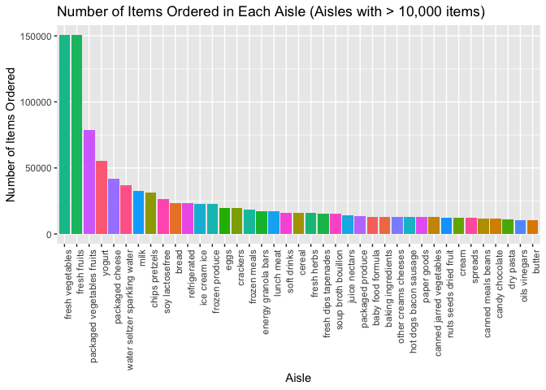
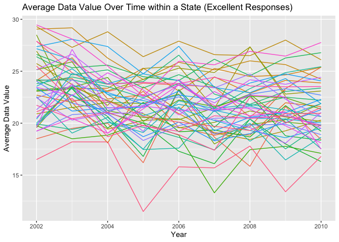
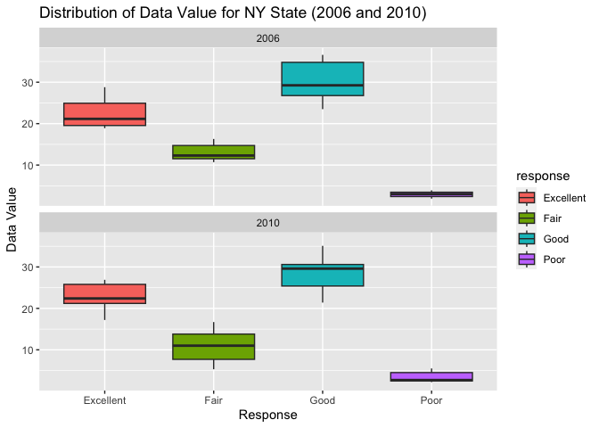

p8105_hw3_hc3451
================
Huanyu Chen
2023-10-07

# Problem 1

This dataset has 1,384,617 rows and 15 variables. This dataset is a
Tabular structure with each row representing an order and each column
representing an attribute. Key variables include order_id: identifier
for the order; aisle_id: identifier for the aisle; product_id:
identifier for the product; aisle: name of the aisle; product_name: name
of the product, etc.

``` r
# Number of aisles
num_aisles <- length(unique(instacart$aisle))
print(paste("Number of aisles:", num_aisles))
```

    ## [1] "Number of aisles: 134"

``` r
# Most items
aisle_order_counts <- table(instacart$aisle)
sorted_aisles <- names(sort(aisle_order_counts, decreasing = TRUE))
print("Most items are ordered from: Fresh Vegetable.")
```

    ## [1] "Most items are ordered from: Fresh Vegetable."

``` r
library(ggplot2)

filtered_aisles <- names(aisle_order_counts[aisle_order_counts > 10000])
filtered_data <- instacart[instacart$aisle %in% filtered_aisles,]
ggplot(filtered_data, aes(x = reorder(aisle, -table(aisle)[aisle]), fill = aisle)) +
  geom_bar() +
  theme(axis.text.x = element_text(angle = 90, hjust = 1)) +
  guides(fill = FALSE) +
  labs(x = "Aisle", y = "Number of Items Ordered", title = "Number of Items Ordered in Each Aisle (Aisles with > 10,000 items)")
```

    ## Warning: The `<scale>` argument of `guides()` cannot be `FALSE`. Use "none" instead as
    ## of ggplot2 3.3.4.
    ## This warning is displayed once every 8 hours.
    ## Call `lifecycle::last_lifecycle_warnings()` to see where this warning was
    ## generated.

<!-- -->

``` r
library(dplyr)
```

    ## 
    ## Attaching package: 'dplyr'

    ## The following objects are masked from 'package:stats':
    ## 
    ##     filter, lag

    ## The following objects are masked from 'package:base':
    ## 
    ##     intersect, setdiff, setequal, union

``` r
library(knitr)

target_aisles <- c("baking ingredients", "dog food care", "packaged vegetables fruits")
filtered_data <- instacart |>
  filter(aisle %in% target_aisles)

product_counts <- filtered_data |>
  group_by(aisle, product_name) |>
  summarise(count = n()) |>
  arrange(aisle, desc(count)) |>
  top_n(3, count)
```

    ## `summarise()` has grouped output by 'aisle'. You can override using the
    ## `.groups` argument.

``` r
print("Top 3 Most Popular Items in Each Aisle:")
```

    ## [1] "Top 3 Most Popular Items in Each Aisle:"

``` r
print(product_counts)
```

    ## # A tibble: 9 × 3
    ## # Groups:   aisle [3]
    ##   aisle                      product_name                                  count
    ##   <chr>                      <chr>                                         <int>
    ## 1 baking ingredients         Light Brown Sugar                               499
    ## 2 baking ingredients         Pure Baking Soda                                387
    ## 3 baking ingredients         Cane Sugar                                      336
    ## 4 dog food care              Snack Sticks Chicken & Rice Recipe Dog Treats    30
    ## 5 dog food care              Organix Chicken & Brown Rice Recipe              28
    ## 6 dog food care              Small Dog Biscuits                               26
    ## 7 packaged vegetables fruits Organic Baby Spinach                           9784
    ## 8 packaged vegetables fruits Organic Raspberries                            5546
    ## 9 packaged vegetables fruits Organic Blueberries                            4966

``` r
library(tidyr)

target_products <- c("Pink Lady Apples", "Coffee Ice Cream")
filtered_data <- instacart |>
  filter(product_name %in% target_products)

mean_hour_table <- filtered_data |>
  group_by(product_name, order_dow) |>
  summarise(mean_hour = mean(order_hour_of_day))
```

    ## `summarise()` has grouped output by 'product_name'. You can override using the
    ## `.groups` argument.

``` r
mean_hour_pivot <- mean_hour_table |>
  pivot_wider(names_from = order_dow, values_from = mean_hour)
colnames(mean_hour_pivot) <- c("Product Name", "Sunday", "Monday", "Tuesday", "Wednesday", "Thursday", "Friday", "Saturday")
mean_hour_pivot
```

    ## # A tibble: 2 × 8
    ## # Groups:   Product Name [2]
    ##   `Product Name`   Sunday Monday Tuesday Wednesday Thursday Friday Saturday
    ##   <chr>             <dbl>  <dbl>   <dbl>     <dbl>    <dbl>  <dbl>    <dbl>
    ## 1 Coffee Ice Cream   13.8   14.3    15.4      15.3     15.2   12.3     13.8
    ## 2 Pink Lady Apples   13.4   11.4    11.7      14.2     11.6   12.8     11.9

# Problem 2

``` r
# Data Cleaning
library(p8105.datasets)
data("brfss_smart2010")

brfss_smart2010 <- janitor::clean_names(brfss_smart2010)
response_order <- c("Poor", "Fair", "Good", "Very good", "Excellent")
brfss_smart2010_health <- brfss_smart2010 |>
  filter(topic == 'Overall Health') |>
  # filter(response == c("Poor", "Fair", "Good", "Very good", "Excellent")) |>
  mutate(response_order = match(response, response_order)) |>
  arrange(response_order)
  # select(response)
write.csv(brfss_smart2010_health, "brfss_smart2010_health.csv", row.names = FALSE)
```

In 2002, which states were observed at 7 or more locations? What about
in 2010?

``` r
states_observed_2002 <- brfss_smart2010_health |>
  filter(year == 2002) |>
  count(locationabbr) |>
  filter(n >= 7) |>
  select(locationabbr)

states_observed_2002 <- as.character(states_observed_2002$locationabbr)
print("The following states were observed at 7 or more locations in 2002:")
```

    ## [1] "The following states were observed at 7 or more locations in 2002:"

``` r
print(states_observed_2002)
```

    ##  [1] "AZ" "CO" "CT" "DE" "FL" "GA" "HI" "ID" "IL" "IN" "KS" "LA" "MA" "MD" "ME"
    ## [16] "MI" "MN" "MO" "NC" "NE" "NH" "NJ" "NV" "NY" "OH" "OK" "OR" "PA" "RI" "SC"
    ## [31] "SD" "TN" "TX" "UT" "VT" "WA"

``` r
states_observed_2010 <- brfss_smart2010_health |>
  filter(year == 2010) |>
  count(locationabbr) |>
  filter(n >= 7) |>
  select(locationabbr)

states_observed_2010 <- as.character(states_observed_2010$locationabbr)
print("The following states were observed at 7 or more locations in 2010:")
```

    ## [1] "The following states were observed at 7 or more locations in 2010:"

``` r
print(states_observed_2010)
```

    ##  [1] "AL" "AR" "AZ" "CA" "CO" "CT" "DE" "FL" "GA" "HI" "IA" "ID" "IL" "IN" "KS"
    ## [16] "LA" "MA" "MD" "ME" "MI" "MN" "MO" "MS" "MT" "NC" "ND" "NE" "NH" "NJ" "NM"
    ## [31] "NV" "NY" "OH" "OK" "OR" "PA" "RI" "SC" "SD" "TN" "TX" "UT" "VT" "WA" "WY"

Construct a dataset that is limited to `Excellent` responses, and
contains, year, state, and a variable that averages the `data_value`
across locations within a state. Make a “spaghetti” plot of this average
value over time within a state (that is, make a plot showing a line for
each state across years – the `geom_line` geometry and `group` aesthetic
will help).

``` r
excellent_responses <- brfss_smart2010_health |>
  filter(response == "Excellent")
average_data_value <- excellent_responses |>
  group_by(year, locationabbr) |>
  summarize(average_data_value = mean(data_value))
```

    ## `summarise()` has grouped output by 'year'. You can override using the
    ## `.groups` argument.

``` r
ggplot(average_data_value, aes(x = year, y = average_data_value, group = locationabbr, color = locationabbr)) +
  geom_line() +
  guides(color = FALSE) +
  labs(x = "Year", y = "Average Data Value", title = "Average Data Value Over Time within a State (Excellent Responses)")
```

    ## Warning: Removed 3 rows containing missing values (`geom_line()`).

<!-- -->

Make a two-panel plot showing, for the years 2006, and 2010,
distribution of data_value for responses (“Poor” to “Excellent”) among
locations in NY State.

``` r
ny_data_2006_2010 <- brfss_smart2010_health |>
  filter(year %in% c(2006, 2010), locationabbr == "NY", response %in% c("Poor", "Fair", "Good", "Very Good", "Excellent"))

ggplot(ny_data_2006_2010, aes(x = response, y = data_value, fill = response)) +
  geom_boxplot() +
  facet_wrap(~ year, ncol = 1) +
  labs(x = "Response", y = "Data Value", title = "Distribution of Data Value for NY State (2006 and 2010)")
```

<!-- -->

# Problem 3
