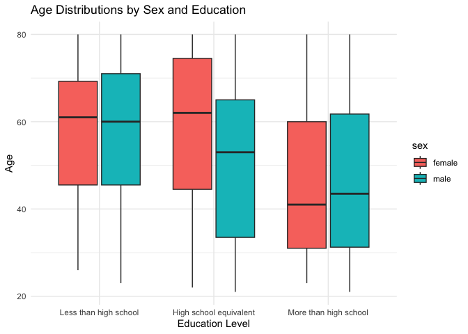
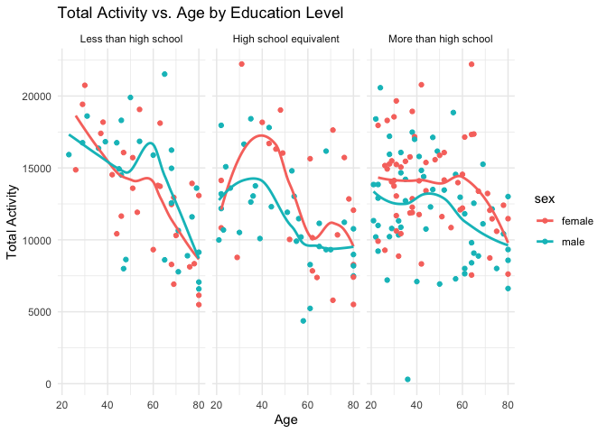
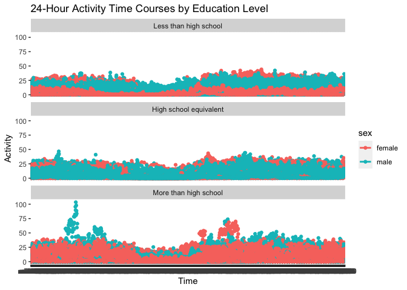

p8105_hw3_hc3451
================
Huanyu Chen
2023-10-10

# Problem 1

## Conclusion:

This dataset has 1,384,617 rows and 15 variables. This dataset is a
Tabular structure with each row representing an order and each column
representing an attribute. Key variables include order_id: identifier
for the order; aisle_id: identifier for the aisle; product_id:
identifier for the product; aisle: name of the aisle; product_name: name
of the product, etc.

``` r
# Number of aisles
num_aisles <- length(unique(instacart$aisle))
print(paste("Number of aisles:", num_aisles))
```

    ## [1] "Number of aisles: 134"

``` r
# Most items
aisle_order_counts <- table(instacart$aisle)
sorted_aisles <- names(sort(aisle_order_counts, decreasing = TRUE))
print("Most items are ordered from: Fresh Vegetable.")
```

    ## [1] "Most items are ordered from: Fresh Vegetable."

``` r
library(ggplot2)

filtered_aisles <- names(aisle_order_counts[aisle_order_counts > 10000])
filtered_data <- instacart[instacart$aisle %in% filtered_aisles,]
ggplot(filtered_data, aes(x = reorder(aisle, -table(aisle)[aisle]), fill = aisle)) +
  geom_bar() +
  theme(axis.text.x = element_text(angle = 90, hjust = 1)) +
  guides(fill = FALSE) +
  labs(x = "Aisle", y = "Number of Items Ordered", title = "Number of Items Ordered in Each Aisle (Aisles with > 10,000 items)")
```

    ## Warning: The `<scale>` argument of `guides()` cannot be `FALSE`. Use "none" instead as
    ## of ggplot2 3.3.4.
    ## This warning is displayed once every 8 hours.
    ## Call `lifecycle::last_lifecycle_warnings()` to see where this warning was
    ## generated.

<!-- -->

``` r
library(dplyr)
```

    ## 
    ## Attaching package: 'dplyr'

    ## The following objects are masked from 'package:stats':
    ## 
    ##     filter, lag

    ## The following objects are masked from 'package:base':
    ## 
    ##     intersect, setdiff, setequal, union

``` r
library(knitr)

target_aisles <- c("baking ingredients", "dog food care", "packaged vegetables fruits")
filtered_data <- instacart |>
  filter(aisle %in% target_aisles)

product_counts <- filtered_data |>
  group_by(aisle, product_name) |>
  summarise(count = n()) |>
  arrange(aisle, desc(count)) |>
  top_n(3, count)
```

    ## `summarise()` has grouped output by 'aisle'. You can override using the
    ## `.groups` argument.

``` r
print("Top 3 Most Popular Items in Each Aisle:")
```

    ## [1] "Top 3 Most Popular Items in Each Aisle:"

``` r
print(product_counts)
```

    ## # A tibble: 9 × 3
    ## # Groups:   aisle [3]
    ##   aisle                      product_name                                  count
    ##   <chr>                      <chr>                                         <int>
    ## 1 baking ingredients         Light Brown Sugar                               499
    ## 2 baking ingredients         Pure Baking Soda                                387
    ## 3 baking ingredients         Cane Sugar                                      336
    ## 4 dog food care              Snack Sticks Chicken & Rice Recipe Dog Treats    30
    ## 5 dog food care              Organix Chicken & Brown Rice Recipe              28
    ## 6 dog food care              Small Dog Biscuits                               26
    ## 7 packaged vegetables fruits Organic Baby Spinach                           9784
    ## 8 packaged vegetables fruits Organic Raspberries                            5546
    ## 9 packaged vegetables fruits Organic Blueberries                            4966

``` r
library(tidyr)

target_products <- c("Pink Lady Apples", "Coffee Ice Cream")
filtered_data <- instacart |>
  filter(product_name %in% target_products)

mean_hour_table <- filtered_data |>
  group_by(product_name, order_dow) |>
  summarise(mean_hour = mean(order_hour_of_day))
```

    ## `summarise()` has grouped output by 'product_name'. You can override using the
    ## `.groups` argument.

``` r
mean_hour_pivot <- mean_hour_table |>
  pivot_wider(names_from = order_dow, values_from = mean_hour)
colnames(mean_hour_pivot) <- c("Product Name", "Sunday", "Monday", "Tuesday", "Wednesday", "Thursday", "Friday", "Saturday")
mean_hour_pivot
```

    ## # A tibble: 2 × 8
    ## # Groups:   Product Name [2]
    ##   `Product Name`   Sunday Monday Tuesday Wednesday Thursday Friday Saturday
    ##   <chr>             <dbl>  <dbl>   <dbl>     <dbl>    <dbl>  <dbl>    <dbl>
    ## 1 Coffee Ice Cream   13.8   14.3    15.4      15.3     15.2   12.3     13.8
    ## 2 Pink Lady Apples   13.4   11.4    11.7      14.2     11.6   12.8     11.9

# Problem 2

``` r
# Data Cleaning
library(p8105.datasets)
data("brfss_smart2010")

brfss_smart2010 <- janitor::clean_names(brfss_smart2010)
response_order <- c("Poor", "Fair", "Good", "Very good", "Excellent")
brfss_smart2010_health <- brfss_smart2010 |>
  filter(topic == 'Overall Health') |>
  # filter(response == c("Poor", "Fair", "Good", "Very good", "Excellent")) |>
  mutate(response_order = match(response, response_order)) |>
  arrange(response_order)
  # select(response)
write.csv(brfss_smart2010_health, "brfss_smart2010_health.csv", row.names = FALSE)
```

In 2002, which states were observed at 7 or more locations? What about
in 2010?

``` r
states_observed_2002 <- brfss_smart2010_health |>
  filter(year == 2002) |>
  count(locationabbr) |>
  filter(n >= 7) |>
  select(locationabbr)

states_observed_2002 <- as.character(states_observed_2002$locationabbr)
print("The following states were observed at 7 or more locations in 2002:")
```

    ## [1] "The following states were observed at 7 or more locations in 2002:"

``` r
print(states_observed_2002)
```

    ##  [1] "AZ" "CO" "CT" "DE" "FL" "GA" "HI" "ID" "IL" "IN" "KS" "LA" "MA" "MD" "ME"
    ## [16] "MI" "MN" "MO" "NC" "NE" "NH" "NJ" "NV" "NY" "OH" "OK" "OR" "PA" "RI" "SC"
    ## [31] "SD" "TN" "TX" "UT" "VT" "WA"

``` r
states_observed_2010 <- brfss_smart2010_health |>
  filter(year == 2010) |>
  count(locationabbr) |>
  filter(n >= 7) |>
  select(locationabbr)

states_observed_2010 <- as.character(states_observed_2010$locationabbr)
print("The following states were observed at 7 or more locations in 2010:")
```

    ## [1] "The following states were observed at 7 or more locations in 2010:"

``` r
print(states_observed_2010)
```

    ##  [1] "AL" "AR" "AZ" "CA" "CO" "CT" "DE" "FL" "GA" "HI" "IA" "ID" "IL" "IN" "KS"
    ## [16] "LA" "MA" "MD" "ME" "MI" "MN" "MO" "MS" "MT" "NC" "ND" "NE" "NH" "NJ" "NM"
    ## [31] "NV" "NY" "OH" "OK" "OR" "PA" "RI" "SC" "SD" "TN" "TX" "UT" "VT" "WA" "WY"

Construct a dataset that is limited to `Excellent` responses, and
contains, year, state, and a variable that averages the `data_value`
across locations within a state. Make a “spaghetti” plot of this average
value over time within a state (that is, make a plot showing a line for
each state across years – the `geom_line` geometry and `group` aesthetic
will help).

``` r
excellent_responses <- brfss_smart2010_health |>
  filter(response == "Excellent")
average_data_value <- excellent_responses |>
  group_by(year, locationabbr) |>
  summarize(average_data_value = mean(data_value))
```

    ## `summarise()` has grouped output by 'year'. You can override using the
    ## `.groups` argument.

``` r
ggplot(average_data_value, aes(x = year, y = average_data_value, group = locationabbr, color = locationabbr)) +
  geom_line() +
  guides(color = FALSE) +
  labs(x = "Year", y = "Average Data Value", title = "Average Data Value Over Time within a State (Excellent Responses)")
```

    ## Warning: Removed 3 rows containing missing values (`geom_line()`).

<!-- -->

## Conclusion:

We can find that the average data value varies among the year as well as
different states.

Make a two-panel plot showing, for the years 2006, and 2010,
distribution of data_value for responses (“Poor” to “Excellent”) among
locations in NY State.

``` r
ny_data_2006_2010 <- brfss_smart2010_health |>
  filter(year %in% c(2006, 2010), locationabbr == "NY", response %in% c("Poor", "Fair", "Good", "Very Good", "Excellent"))

ggplot(ny_data_2006_2010, aes(x = response, y = data_value, fill = response)) +
  geom_boxplot() +
  facet_wrap(~ year, ncol = 2) +
  labs(x = "Response", y = "Data Value", 
       title = "Distribution of Data Value for NY State (2006 and 2010)") +
  guides(fill = FALSE) +
  theme_minimal()
```

<!-- -->

## Conclusion:

We can observe a similar distribution in 2006 and 2010. The response
“good” has the highest average data value and the response “poor” has
the lowest average data value.

# Problem 3

``` r
library(tidyr)
nhanes_covar <- read.csv("./nhanes_covar.csv", skip = 4)

nhanes_covar_filter <- drop_na(nhanes_covar) |>
  filter(age >= 21) |>
  mutate(sex = ifelse(sex == 1, "male", "female")) |>
  mutate(education = case_when(
    education == 1 ~ "Less than high school",
    education == 2 ~ "High school equivalent",
    education == 3 ~ "More than high school",
    )) |>
  arrange(sex, age, education) |>
  mutate(education = factor(education, levels = c("Less than high school", "High school equivalent", "More than high school"), ordered = TRUE))
head(nhanes_covar_filter)
```

    ##    SEQN    sex age  BMI              education
    ## 1 62214 female  22 23.8 High school equivalent
    ## 2 62239 female  22 23.3 High school equivalent
    ## 3 62349 female  23 38.0  More than high school
    ## 4 62444 female  23 33.6  More than high school
    ## 5 62639 female  26 38.6  Less than high school
    ## 6 62249 female  26 20.3  More than high school

``` r
# Merge
nhanes_accel <- read.csv("./nhanes_accel.csv")
nhanes_accel_filter <- nhanes_accel |>
  filter(SEQN %in% nhanes_covar_filter$SEQN)

merged_nhanes <- inner_join(nhanes_accel_filter, nhanes_covar_filter, by = "SEQN")
merged_nhanes <- merged_nhanes |>
  select(SEQN, sex, age, BMI, education, everything())
```

``` r
library(ggplot2)
# The number of men and women in each education category
education_counts <- merged_nhanes |>
  group_by(education, sex) |>
  summarise(count = n())
```

    ## `summarise()` has grouped output by 'education'. You can override using the
    ## `.groups` argument.

``` r
education_counts
```

    ## # A tibble: 6 × 3
    ## # Groups:   education [3]
    ##   education              sex    count
    ##   <ord>                  <chr>  <int>
    ## 1 Less than high school  female    28
    ## 2 Less than high school  male      27
    ## 3 High school equivalent female    23
    ## 4 High school equivalent male      35
    ## 5 More than high school  female    59
    ## 6 More than high school  male      56

``` r
# Create Plot
age_distribution_plot = ggplot(merged_nhanes, aes(x = education, y = age, fill = sex)) +
  geom_boxplot() +
  labs(title = "Age Distributions by Sex and Education",
       x = "Education Level",
       y = "Age") +
  theme_minimal()
age_distribution_plot
```

<!-- -->

## Conclusion:

At education levels less than high school and more than high school, the
mean age value is comparable for males and females. Females have a
higher mean age than males at the high school equivalent education
level.

``` r
combine_minutes <- merged_nhanes |>
  pivot_longer(min1:min1440, names_to = "time_min", values_to = "mins") |>
  na.omit()

total_min <- combine_minutes |>
  group_by(SEQN, sex, age, BMI, education) |>
  summarise(total = sum(mins)) 
```

    ## `summarise()` has grouped output by 'SEQN', 'sex', 'age', 'BMI'. You can
    ## override using the `.groups` argument.

``` r
head(total_min)
```

    ## # A tibble: 6 × 6
    ## # Groups:   SEQN, sex, age, BMI [6]
    ##    SEQN sex      age   BMI education               total
    ##   <int> <chr>  <int> <dbl> <ord>                   <dbl>
    ## 1 62161 male      22  23.3 High school equivalent 13194.
    ## 2 62164 female    44  23.2 More than high school  13411.
    ## 3 62169 male      21  20.1 High school equivalent  9991.
    ## 4 62174 male      80  33.9 More than high school   8579.
    ## 5 62177 male      51  20.1 High school equivalent 11918.
    ## 6 62178 male      80  28.5 High school equivalent  7489.

``` r
# Total Activity vs. Age by Education Level
total_min_plot <- ggplot(total_min, aes(x = age, y = total, color = sex)) +
  geom_point()  +
  geom_smooth(se=FALSE) +
  facet_wrap(~ education, ncol = 3) +
  labs(title = "Total Activity vs. Age by Education Level",
       x = "Age",
       y = "Total Activity") +
  theme_minimal()
total_min_plot
```

    ## `geom_smooth()` using method = 'loess' and formula = 'y ~ x'

<!-- -->

## Conclusion

After roughly 60 years old, the overall activity value decreases with
age approximately. Males are more active than females with less than a
high school degree. Females have greater activity than males at the high
school equivalent and higher education levels.

``` r
activity_time_plot <- ggplot(combine_minutes, aes(x = time_min, y = mins, color = sex)) +
  geom_point()  +
  geom_smooth(se = FALSE) +
  facet_wrap(~ education, ncol = 1) +
  labs(title = "24-Hour Activity Time Courses by Education Level",
       x = "Time",
       y = "Activity")
activity_time_plot
```

    ## `geom_smooth()` using method = 'loess' and formula = 'y ~ x'

<!-- -->

## Conclusion

The trends between gender are similar, indicating that there is no
significant difference for their activity between male and female. And
the trends in three educational levels are similar, indicating that
there is no significant difference for activity among educational
levels.
